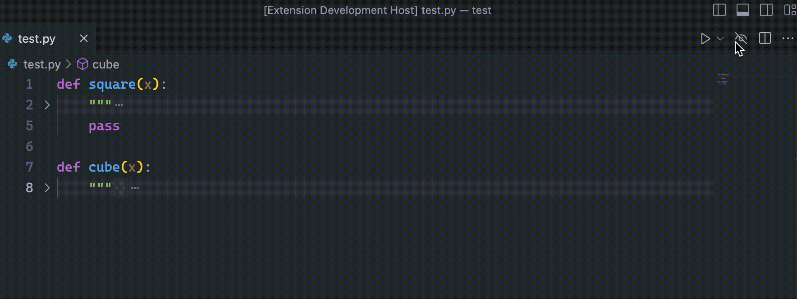

# Toggle Docstrings

This is a simple extension to show/hide Docstrings. It is primarily targeted for Python/Jupyter.
However, It may work fine with other programming languages.

## Features

Here is simple demo of how it works:

## Requirements
No Particular requirements.
